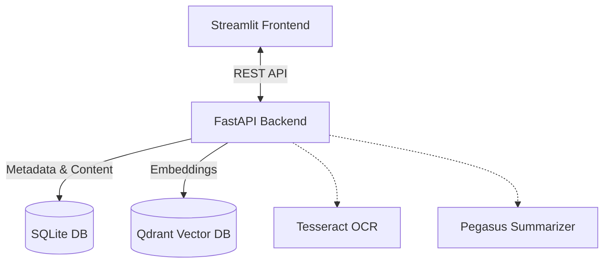

<h1 align="center">🌟 AI File Management System</h1>

<p align="center">
  <em>An AI‑powered document intelligence platform that enables intelligent document processing, semantic search, summarization, tagging, duplicate detection, merging, and AI‑assisted document rewriting through an interactive Streamlit interface.</em>
</p>

<p align="center">
  
  
  
  
</p>

---

## 🚀 Overview

The **AI File Management System** is designed to help users upload, analyze, search, compare, merge, and transform documents intelligently using modern AI techniques. 

### ✨ Core Capabilities

- **📄 Universal Upload:** Support for PDFs, DOCX, and images (PNG, JPG).
- **🔍 Advanced Layout-Aware OCR:** Precision text extraction using Tesseract that understands flowcharts and graphical blocks.
- **📝 Dynamic AI Summaries:** Generate short, medium, or long document summaries on the fly.
- **🧠 Semantic Vectors:** Perform deep meaning-based search using sentence embeddings.
- **🔗 Similarity & Deduplication:** Automatically find similar and duplicate documents.
- **🏷️ Auto-Tagging Engine:** Automatically tag documents and filter/search by interactive tags.
- **🔡 Keyword Frequency Search:** Quickly find the exact file where a keyword appears most frequently.
- **🧩 Smart Document Merge:** Merge multiple files in sequence into a single clean document.
- **🤖 AI Document Chatbot:** Chat with an agent to rewrite, shorten, or extract topics.
- **⬇️ Multi-Format Export:** Download AI outputs as TXT, DOCX, or PDF.

> **Workflow:**
> `Upload` ➔ `Process` ➔ `Search` ➔ `Explore` ➔ `Compare` ➔ `Merge` ➔ `Rewrite` ➔ `Download`

---

## 🧩 Development Phases

<details>
<summary><b>🌱 Phase 0: Base Version (Foundation)</b></summary>

- ✔️ File upload (PDF, DOCX, Images)
- ✔️ Advanced layout-aware OCR text extraction using Tesseract
- ✔️ Store extracted text & metadata in SQLite
- ✔️ Basic AI summarization
- ✔️ List and view uploaded files
</details>

<details>
<summary><b>🔹 Phase 1: Semantic Embeddings & Vector Search</b></summary>

- ✔️ Sentence‑Transformers embeddings
- ✔️ Integrated Qdrant Vector Database
- ✔️ Chunk‑based embeddings for large documents
- ✔️ Semantic search returns: Best matching snippet, Document summary, and Similarity score

> **Endpoint**: `GET /api/search?query=text`
</details>

<details>
<summary><b>🔹 Phase 2: Dynamic AI Summaries</b></summary>

- ✔️ Powered by Pegasus‑XSUM
- ✔️ UI controls in Streamlit for length limits

| Mode | Description | Output |
| :--- | :--- | :--- |
| `short` | Ultra‑brief | 1 sentence |
| `medium` | Balanced | 2 sentences |
| `long` | Detailed | 4 sentences |

> **Endpoint**: `GET /api/files/{id}/summary?mode=short|medium|long`
</details>

<details>
<summary><b>🔹 Phase 3: Similarity & Duplicate Detection</b></summary>

- ✔️ Embedding‑based similarity detection
- ✔️ High‑threshold duplicate detection algorithms
- ✔️ Immediate UI actions for similar & duplicate discovery

> **Endpoints**: `GET /api/files/{id}/similar` | `GET /api/files/{id}/duplicates`
</details>

<details>
<summary><b>🔹 Phase 4: Auto‑Tagging System</b></summary>

- ✔️ Keyword extraction from AI summaries
- ✔️ Visual layout tag UI
- ✔️ Search and filter files interactively using 'Tag Search' in the UI
- ✔️ Visually display interactive tags on the File Details page

> **Endpoint**: `GET /api/files/tag/{tag}`
</details>

<details>
<summary><b>🔹 Phase 5: Word Count Search (Keyword Frequency Engine)</b></summary>

- ✔️ Finds the file where a keyword appears most frequently across all formats
- ✔️ Displays full content with dynamic text highlights in the UI

> **Endpoint**: `GET /api/search-word?query=word`
</details>

<details>
<summary><b>🔹 Phase 6: File Merge & Export System</b></summary>

- ✔️ Select multiple files from the database to merge chronologically
- ✔️ Instantly download the merged file as `.txt`, `.docx`, or `.pdf`

> **Endpoint**: `POST /api/files/merge`
</details>

<details>
<summary><b>🔹 Phase 7: AI Document Chatbot (Groq‑Powered)</b></summary>

- ✔️ Chat directly with an LLM against your loaded files or fresh local uploads
- ✔️ Ask AI to summarize, extract data, or rewrite content
- ✔️ Powered by Groq (LLaMA‑3.3‑70B‑Versatile) for blazing fast inference
- ✔️ Export generated documents on demand

> **Endpoints**: `POST /api/chat` | `POST /api/chat/convert`
</details>

---

## 🖥️ System Architecture



---

## ⚙️ Quick Setup Instructions

1️⃣ **Install Dependencies**
```bash
pip install -r requirements.txt
```

2️⃣ **Initialize Regional Database**
```bash
python database/init_db.py
```

3️⃣ **Start Qdrant (Docker)**
```bash
docker run -p 6333:6333 qdrant/qdrant
```

4️⃣ **Run the Backend Services**
```bash
uvicorn backend.main:app --reload
```

5️⃣ **Launch the User Interface**
```bash
streamlit run frontend/app.py
```

---

## 🔌 API Reference Matrix

| Feature | Method | Endpoint |
| :--- | :---: | :--- |
| **Upload File** | `POST` | `/api/upload` |
| **Semantic Search** | `GET` | `/api/search?query=text` |
| **Word Count Search** | `GET` | `/api/search-word?query=word` |
| **Dynamic Summary** | `GET` | `/api/files/{id}/summary?mode=short\|medium\|long` |
| **Similar Files** | `GET` | `/api/files/{id}/similar` |
| **Duplicates** | `GET` | `/api/files/{id}/duplicates` |
| **Tag Search** | `GET` | `/api/files/by-tag?tag=keyword` |
| **Merge Files** | `POST` | `/api/files/merge` |
| **AI Chat** | `POST` | `/api/chat` |
| **Export Chat** | `POST` | `/api/chat/convert` |

---

## 🧑‍💻 Tech Stack

| Layer | Technology |
| :--- | :--- |
| **Backend** | FastApi |
| **Frontend** | Streamlit |
| **Database** | SQLite |
| **Vector Engine** | Qdrant |
| **Embeddings** | Sentence-Transformers |
| **Summarization** | Pegasus-XSUM |
| **AI Intelligent Chat** | Groq (LLaMA-3.3-70B) |
| **OCR Processing** | Tesseract |
| **Core Language** | Python |

---

## 👥 Author

**Sole Developer / Single Member Project**

> **🎯 Final Outcome** <br/>
> A production‑style AI document intelligence system capable of reading mixed formats (PDFs, DOCX, images), structurally preserving flowchart diagram OCR, auto-summarizing, semantically searching vector space, auto-tagging, detecting deduplication, performing keyword analytics, assembling multi-format exports, and hosting an interactive rewrite chat loop all inside a polished GUI.